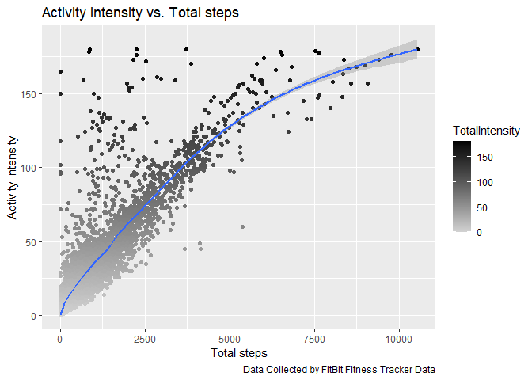
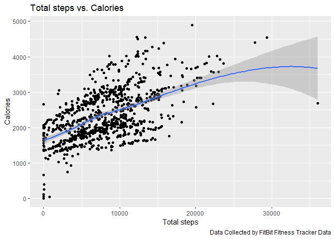
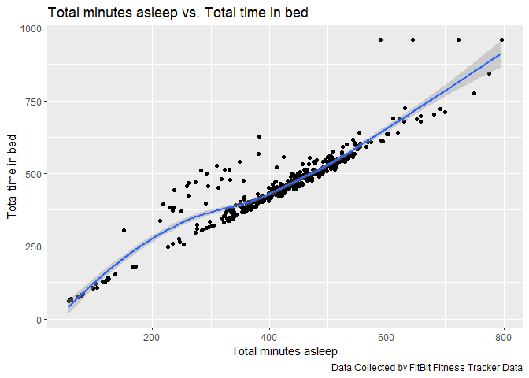
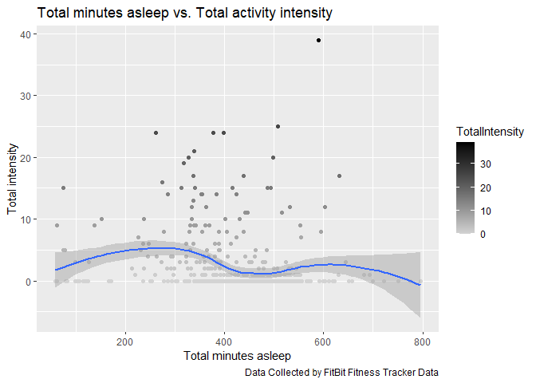
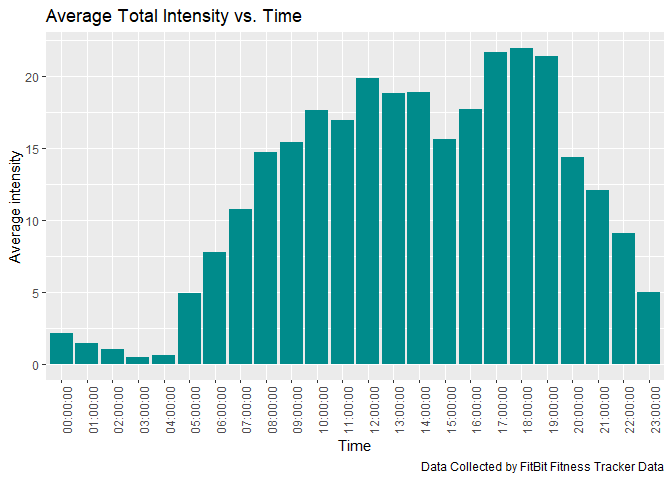

Bellabeat_case
================
Camila
2024-07-07

### **Introduction**

As a junior data analyst on the marketing analyst team at Bellabeat, a
rising and successful company that develops high-tech products focused
on women’s health, you face an exciting challenge. Although Bellabeat is
already a recognized player, it has the potential to expand
significantly in the global market for smart devices. Urška Sršen,
co-founder and creative director of the company, is convinced that
analyzing data from physical activity captured by these devices can open
new doors for business opportunities.

Your mission is to focus on one of Bellabeat’s products to delve into
the analysis of smart device data, exploring how consumers interact with
these devices. The discoveries you make will be key to defining
Bellabeat’s marketing strategies. You are scheduled to present your
findings and strategic recommendations to the company’s executive team.

Additionally, Urška Sršen has asked you to examine the usage data of
smart devices from other brands to understand how consumers use
competing equipment. This analysis should help you select a Bellabeat
product and apply these insights in your presentation.

### **Ask**

The following questions will guide your analysis and help focus your
efforts on key areas that could translate into competitive advantages
for Bellabeat in the market.

- What are some trends in the usage of smart devices?

- How could these trends be applied to Bellabeat’s customers?

- How could these trends help influence Bellabeat’s marketing strategy?

#### **Business task**

Identify smart device usage trends that can be applied to a Bellabeat
product and serve as a growth and marketing opportunity for the company.

### **Preparation**

We are working with data organized in a wide format and stored in csv
files. These data are integral, reliable, and updated periodically, the
last update was a month ago. However, they lack complete metadata.
Regarding authorization, privacy, security, and accessibility, the data
are under the CC0: Public Domain license. Access to the data is limited
to authorized individuals, and transparent privacy policies are
implemented. Periodic security audits are carried out, and the
availability and accessibility of the data for those who need it are
ensured. We verified the integrity of the data through a source review,
metadata validation, initial exploration, data cleaning, integrity
tests, documentation and traceability, and cross-validation. This
verification allows us to ensure the reliability and validity of the
results of a data analysis. However, one limitation is that the data do
not include demographic, gender, or age information, which could
introduce biases and discrepancies in analytical results.

### **Process**

#### **Loading packages**

``` r
library(tidyverse)
```

    ## ── Attaching core tidyverse packages ──────────────────────── tidyverse 2.0.0 ──
    ## ✔ dplyr     1.1.4     ✔ readr     2.1.5
    ## ✔ forcats   1.0.0     ✔ stringr   1.5.1
    ## ✔ ggplot2   3.5.0     ✔ tibble    3.2.1
    ## ✔ lubridate 1.9.3     ✔ tidyr     1.3.1
    ## ✔ purrr     1.0.2     
    ## ── Conflicts ────────────────────────────────────────── tidyverse_conflicts() ──
    ## ✖ dplyr::filter() masks stats::filter()
    ## ✖ dplyr::lag()    masks stats::lag()
    ## ℹ Use the conflicted package (<http://conflicted.r-lib.org/>) to force all conflicts to become errors

``` r
library(lubridate)
library(janitor)
```

    ## 
    ## Attaching package: 'janitor'
    ## 
    ## The following objects are masked from 'package:stats':
    ## 
    ##     chisq.test, fisher.test

``` r
library(here)
```

    ## here() starts at C:/Users/David/Documents/Rmarkdown_BellabeatCase

#### **Loading data sets**

``` r
setwd("C:/Users/David/Documents/Data analisis/Caso practico/mturkfitbit_export_4.12.16-5.12.16/Fitabase Data 4.12.16-5.12.16")
daily_activity <- read_csv("dailyActivity_merged.csv")
```

    ## Rows: 940 Columns: 15
    ## ── Column specification ────────────────────────────────────────────────────────
    ## Delimiter: ","
    ## chr  (1): ActivityDate
    ## dbl (14): Id, TotalSteps, TotalDistance, TrackerDistance, LoggedActivitiesDi...
    ## 
    ## ℹ Use `spec()` to retrieve the full column specification for this data.
    ## ℹ Specify the column types or set `show_col_types = FALSE` to quiet this message.

``` r
daily_sleep <- read_csv("sleepDay_merged.csv")
```

    ## Rows: 413 Columns: 5
    ## ── Column specification ────────────────────────────────────────────────────────
    ## Delimiter: ","
    ## chr (1): SleepDay
    ## dbl (4): Id, TotalSleepRecords, TotalMinutesAsleep, TotalTimeInBed
    ## 
    ## ℹ Use `spec()` to retrieve the full column specification for this data.
    ## ℹ Specify the column types or set `show_col_types = FALSE` to quiet this message.

``` r
daily_steps <- read_csv("dailySteps_merged.csv")
```

    ## Rows: 940 Columns: 3
    ## ── Column specification ────────────────────────────────────────────────────────
    ## Delimiter: ","
    ## chr (1): ActivityDay
    ## dbl (2): Id, StepTotal
    ## 
    ## ℹ Use `spec()` to retrieve the full column specification for this data.
    ## ℹ Specify the column types or set `show_col_types = FALSE` to quiet this message.

``` r
daily_calories <- read_csv("dailyCalories_merged.csv")
```

    ## Rows: 940 Columns: 3
    ## ── Column specification ────────────────────────────────────────────────────────
    ## Delimiter: ","
    ## chr (1): ActivityDay
    ## dbl (2): Id, Calories
    ## 
    ## ℹ Use `spec()` to retrieve the full column specification for this data.
    ## ℹ Specify the column types or set `show_col_types = FALSE` to quiet this message.

``` r
daily_intensities <- read_csv("dailyIntensities_merged.csv")
```

    ## Rows: 940 Columns: 10
    ## ── Column specification ────────────────────────────────────────────────────────
    ## Delimiter: ","
    ## chr (1): ActivityDay
    ## dbl (9): Id, SedentaryMinutes, LightlyActiveMinutes, FairlyActiveMinutes, Ve...
    ## 
    ## ℹ Use `spec()` to retrieve the full column specification for this data.
    ## ℹ Specify the column types or set `show_col_types = FALSE` to quiet this message.

``` r
hourly_steps <- read_csv("hourlySteps_merged.csv")
```

    ## Rows: 22099 Columns: 3
    ## ── Column specification ────────────────────────────────────────────────────────
    ## Delimiter: ","
    ## chr (1): ActivityHour
    ## dbl (2): Id, StepTotal
    ## 
    ## ℹ Use `spec()` to retrieve the full column specification for this data.
    ## ℹ Specify the column types or set `show_col_types = FALSE` to quiet this message.

``` r
hourly_intensities <- read_csv("hourlyIntensities_merged.csv")
```

    ## Rows: 22099 Columns: 4
    ## ── Column specification ────────────────────────────────────────────────────────
    ## Delimiter: ","
    ## chr (1): ActivityHour
    ## dbl (3): Id, TotalIntensity, AverageIntensity
    ## 
    ## ℹ Use `spec()` to retrieve the full column specification for this data.
    ## ℹ Specify the column types or set `show_col_types = FALSE` to quiet this message.

``` r
hourly_calories <- read_csv("hourlyCalories_merged.csv")
```

    ## Rows: 22099 Columns: 3
    ## ── Column specification ────────────────────────────────────────────────────────
    ## Delimiter: ","
    ## chr (1): ActivityHour
    ## dbl (2): Id, Calories
    ## 
    ## ℹ Use `spec()` to retrieve the full column specification for this data.
    ## ℹ Specify the column types or set `show_col_types = FALSE` to quiet this message.

#### **Preview the loaded data**

``` r
str(daily_activity)
```

    ## spc_tbl_ [940 × 15] (S3: spec_tbl_df/tbl_df/tbl/data.frame)
    ##  $ Id                      : num [1:940] 1.5e+09 1.5e+09 1.5e+09 1.5e+09 1.5e+09 ...
    ##  $ ActivityDate            : chr [1:940] "4/12/2016" "4/13/2016" "4/14/2016" "4/15/2016" ...
    ##  $ TotalSteps              : num [1:940] 13162 10735 10460 9762 12669 ...
    ##  $ TotalDistance           : num [1:940] 8.5 6.97 6.74 6.28 8.16 ...
    ##  $ TrackerDistance         : num [1:940] 8.5 6.97 6.74 6.28 8.16 ...
    ##  $ LoggedActivitiesDistance: num [1:940] 0 0 0 0 0 0 0 0 0 0 ...
    ##  $ VeryActiveDistance      : num [1:940] 1.88 1.57 2.44 2.14 2.71 ...
    ##  $ ModeratelyActiveDistance: num [1:940] 0.55 0.69 0.4 1.26 0.41 ...
    ##  $ LightActiveDistance     : num [1:940] 6.06 4.71 3.91 2.83 5.04 ...
    ##  $ SedentaryActiveDistance : num [1:940] 0 0 0 0 0 0 0 0 0 0 ...
    ##  $ VeryActiveMinutes       : num [1:940] 25 21 30 29 36 38 42 50 28 19 ...
    ##  $ FairlyActiveMinutes     : num [1:940] 13 19 11 34 10 20 16 31 12 8 ...
    ##  $ LightlyActiveMinutes    : num [1:940] 328 217 181 209 221 164 233 264 205 211 ...
    ##  $ SedentaryMinutes        : num [1:940] 728 776 1218 726 773 ...
    ##  $ Calories                : num [1:940] 1985 1797 1776 1745 1863 ...
    ##  - attr(*, "spec")=
    ##   .. cols(
    ##   ..   Id = col_double(),
    ##   ..   ActivityDate = col_character(),
    ##   ..   TotalSteps = col_double(),
    ##   ..   TotalDistance = col_double(),
    ##   ..   TrackerDistance = col_double(),
    ##   ..   LoggedActivitiesDistance = col_double(),
    ##   ..   VeryActiveDistance = col_double(),
    ##   ..   ModeratelyActiveDistance = col_double(),
    ##   ..   LightActiveDistance = col_double(),
    ##   ..   SedentaryActiveDistance = col_double(),
    ##   ..   VeryActiveMinutes = col_double(),
    ##   ..   FairlyActiveMinutes = col_double(),
    ##   ..   LightlyActiveMinutes = col_double(),
    ##   ..   SedentaryMinutes = col_double(),
    ##   ..   Calories = col_double()
    ##   .. )
    ##  - attr(*, "problems")=<externalptr>

``` r
str(daily_sleep)
```

    ## spc_tbl_ [413 × 5] (S3: spec_tbl_df/tbl_df/tbl/data.frame)
    ##  $ Id                : num [1:413] 1.5e+09 1.5e+09 1.5e+09 1.5e+09 1.5e+09 ...
    ##  $ SleepDay          : chr [1:413] "4/12/2016 12:00:00 AM" "4/13/2016 12:00:00 AM" "4/15/2016 12:00:00 AM" "4/16/2016 12:00:00 AM" ...
    ##  $ TotalSleepRecords : num [1:413] 1 2 1 2 1 1 1 1 1 1 ...
    ##  $ TotalMinutesAsleep: num [1:413] 327 384 412 340 700 304 360 325 361 430 ...
    ##  $ TotalTimeInBed    : num [1:413] 346 407 442 367 712 320 377 364 384 449 ...
    ##  - attr(*, "spec")=
    ##   .. cols(
    ##   ..   Id = col_double(),
    ##   ..   SleepDay = col_character(),
    ##   ..   TotalSleepRecords = col_double(),
    ##   ..   TotalMinutesAsleep = col_double(),
    ##   ..   TotalTimeInBed = col_double()
    ##   .. )
    ##  - attr(*, "problems")=<externalptr>

``` r
str(daily_intensities)
```

    ## spc_tbl_ [940 × 10] (S3: spec_tbl_df/tbl_df/tbl/data.frame)
    ##  $ Id                      : num [1:940] 1.5e+09 1.5e+09 1.5e+09 1.5e+09 1.5e+09 ...
    ##  $ ActivityDay             : chr [1:940] "4/12/2016" "4/13/2016" "4/14/2016" "4/15/2016" ...
    ##  $ SedentaryMinutes        : num [1:940] 728 776 1218 726 773 ...
    ##  $ LightlyActiveMinutes    : num [1:940] 328 217 181 209 221 164 233 264 205 211 ...
    ##  $ FairlyActiveMinutes     : num [1:940] 13 19 11 34 10 20 16 31 12 8 ...
    ##  $ VeryActiveMinutes       : num [1:940] 25 21 30 29 36 38 42 50 28 19 ...
    ##  $ SedentaryActiveDistance : num [1:940] 0 0 0 0 0 0 0 0 0 0 ...
    ##  $ LightActiveDistance     : num [1:940] 6.06 4.71 3.91 2.83 5.04 ...
    ##  $ ModeratelyActiveDistance: num [1:940] 0.55 0.69 0.4 1.26 0.41 ...
    ##  $ VeryActiveDistance      : num [1:940] 1.88 1.57 2.44 2.14 2.71 ...
    ##  - attr(*, "spec")=
    ##   .. cols(
    ##   ..   Id = col_double(),
    ##   ..   ActivityDay = col_character(),
    ##   ..   SedentaryMinutes = col_double(),
    ##   ..   LightlyActiveMinutes = col_double(),
    ##   ..   FairlyActiveMinutes = col_double(),
    ##   ..   VeryActiveMinutes = col_double(),
    ##   ..   SedentaryActiveDistance = col_double(),
    ##   ..   LightActiveDistance = col_double(),
    ##   ..   ModeratelyActiveDistance = col_double(),
    ##   ..   VeryActiveDistance = col_double()
    ##   .. )
    ##  - attr(*, "problems")=<externalptr>

``` r
str(hourly_intensities)
```

    ## spc_tbl_ [22,099 × 4] (S3: spec_tbl_df/tbl_df/tbl/data.frame)
    ##  $ Id              : num [1:22099] 1.5e+09 1.5e+09 1.5e+09 1.5e+09 1.5e+09 ...
    ##  $ ActivityHour    : chr [1:22099] "4/12/2016 12:00:00 AM" "4/12/2016 1:00:00 AM" "4/12/2016 2:00:00 AM" "4/12/2016 3:00:00 AM" ...
    ##  $ TotalIntensity  : num [1:22099] 20 8 7 0 0 0 0 0 13 30 ...
    ##  $ AverageIntensity: num [1:22099] 0.333 0.133 0.117 0 0 ...
    ##  - attr(*, "spec")=
    ##   .. cols(
    ##   ..   Id = col_double(),
    ##   ..   ActivityHour = col_character(),
    ##   ..   TotalIntensity = col_double(),
    ##   ..   AverageIntensity = col_double()
    ##   .. )
    ##  - attr(*, "problems")=<externalptr>

We can see that the dates are in chr format and not in date format, we
proceed to correct these formats

#### **Fixing dates format**

``` r
daily_activity$ActivityDate <- as.Date(daily_activity$ActivityDate, format = "%m/%d/%Y")
#Verify the change
str(daily_activity)
```

    ## spc_tbl_ [940 × 15] (S3: spec_tbl_df/tbl_df/tbl/data.frame)
    ##  $ Id                      : num [1:940] 1.5e+09 1.5e+09 1.5e+09 1.5e+09 1.5e+09 ...
    ##  $ ActivityDate            : Date[1:940], format: "2016-04-12" "2016-04-13" ...
    ##  $ TotalSteps              : num [1:940] 13162 10735 10460 9762 12669 ...
    ##  $ TotalDistance           : num [1:940] 8.5 6.97 6.74 6.28 8.16 ...
    ##  $ TrackerDistance         : num [1:940] 8.5 6.97 6.74 6.28 8.16 ...
    ##  $ LoggedActivitiesDistance: num [1:940] 0 0 0 0 0 0 0 0 0 0 ...
    ##  $ VeryActiveDistance      : num [1:940] 1.88 1.57 2.44 2.14 2.71 ...
    ##  $ ModeratelyActiveDistance: num [1:940] 0.55 0.69 0.4 1.26 0.41 ...
    ##  $ LightActiveDistance     : num [1:940] 6.06 4.71 3.91 2.83 5.04 ...
    ##  $ SedentaryActiveDistance : num [1:940] 0 0 0 0 0 0 0 0 0 0 ...
    ##  $ VeryActiveMinutes       : num [1:940] 25 21 30 29 36 38 42 50 28 19 ...
    ##  $ FairlyActiveMinutes     : num [1:940] 13 19 11 34 10 20 16 31 12 8 ...
    ##  $ LightlyActiveMinutes    : num [1:940] 328 217 181 209 221 164 233 264 205 211 ...
    ##  $ SedentaryMinutes        : num [1:940] 728 776 1218 726 773 ...
    ##  $ Calories                : num [1:940] 1985 1797 1776 1745 1863 ...
    ##  - attr(*, "spec")=
    ##   .. cols(
    ##   ..   Id = col_double(),
    ##   ..   ActivityDate = col_character(),
    ##   ..   TotalSteps = col_double(),
    ##   ..   TotalDistance = col_double(),
    ##   ..   TrackerDistance = col_double(),
    ##   ..   LoggedActivitiesDistance = col_double(),
    ##   ..   VeryActiveDistance = col_double(),
    ##   ..   ModeratelyActiveDistance = col_double(),
    ##   ..   LightActiveDistance = col_double(),
    ##   ..   SedentaryActiveDistance = col_double(),
    ##   ..   VeryActiveMinutes = col_double(),
    ##   ..   FairlyActiveMinutes = col_double(),
    ##   ..   LightlyActiveMinutes = col_double(),
    ##   ..   SedentaryMinutes = col_double(),
    ##   ..   Calories = col_double()
    ##   .. )
    ##  - attr(*, "problems")=<externalptr>

``` r
daily_calories$ActivityDay <- as.Date(daily_calories$ActivityDay, format = "%m/%d/%Y")
daily_intensities$ActivityDay <- as.Date(daily_intensities$ActivityDay, format = "%m/%d/%Y")
daily_steps$ActivityDay <- as.Date(daily_steps$ActivityDay, format = "%m/%d/%Y")


#We make the change for date and time

hourly_intensities$ActivityHour <- mdy_hms(hourly_intensities$ActivityHour)
hourly_intensities$time <- format(hourly_intensities$ActivityHour, format= "%H:%M:%S")
hourly_intensities$date <- format(hourly_intensities$ActivityHour, format = "%m/%d/%y")

hourly_steps$ActivityHour <- mdy_hms(hourly_steps$ActivityHour)
hourly_steps$time <-format(hourly_steps$ActivityHour, format= "%H:%M:%S")
hourly_steps$date <- format(hourly_steps$ActivityHour, format = "%m/%d/%y")


hourly_calories$ActivityHour <- mdy_hms(hourly_calories$ActivityHour)
hourly_calories$time <-format(hourly_calories$ActivityHour, format= "%H:%M:%S")
hourly_calories$date <- format(hourly_calories$ActivityHour, format = "%m/%d/%y")


daily_sleep$SleepDay <- mdy_hms(daily_sleep$SleepDay)
daily_sleep$time <- format(daily_sleep$SleepDay, format= "%H:%M:%S")
daily_sleep$date <- format(daily_sleep$SleepDay, format = "%m/%d/%y")

#Verify the change
str(hourly_intensities)
```

    ## spc_tbl_ [22,099 × 6] (S3: spec_tbl_df/tbl_df/tbl/data.frame)
    ##  $ Id              : num [1:22099] 1.5e+09 1.5e+09 1.5e+09 1.5e+09 1.5e+09 ...
    ##  $ ActivityHour    : POSIXct[1:22099], format: "2016-04-12 00:00:00" "2016-04-12 01:00:00" ...
    ##  $ TotalIntensity  : num [1:22099] 20 8 7 0 0 0 0 0 13 30 ...
    ##  $ AverageIntensity: num [1:22099] 0.333 0.133 0.117 0 0 ...
    ##  $ time            : chr [1:22099] "00:00:00" "01:00:00" "02:00:00" "03:00:00" ...
    ##  $ date            : chr [1:22099] "04/12/16" "04/12/16" "04/12/16" "04/12/16" ...
    ##  - attr(*, "spec")=
    ##   .. cols(
    ##   ..   Id = col_double(),
    ##   ..   ActivityHour = col_character(),
    ##   ..   TotalIntensity = col_double(),
    ##   ..   AverageIntensity = col_double()
    ##   .. )
    ##  - attr(*, "problems")=<externalptr>

``` r
head(daily_sleep)
```

    ## # A tibble: 6 × 7
    ##       Id SleepDay            TotalSleepRecords TotalMinutesAsleep TotalTimeInBed
    ##    <dbl> <dttm>                          <dbl>              <dbl>          <dbl>
    ## 1 1.50e9 2016-04-12 00:00:00                 1                327            346
    ## 2 1.50e9 2016-04-13 00:00:00                 2                384            407
    ## 3 1.50e9 2016-04-15 00:00:00                 1                412            442
    ## 4 1.50e9 2016-04-16 00:00:00                 2                340            367
    ## 5 1.50e9 2016-04-17 00:00:00                 1                700            712
    ## 6 1.50e9 2016-04-19 00:00:00                 1                304            320
    ## # ℹ 2 more variables: time <chr>, date <chr>

#### **Explore the data**

We know that the number of participants for this data set was 33,
however some tables may have fewer, depending on whether participants
have agreed to provide that type of information.

*We verify the number of participants for each table.*

``` r
n_distinct(daily_activity$Id)
```

    ## [1] 33

``` r
n_distinct(daily_calories$Id)
```

    ## [1] 33

``` r
n_distinct(daily_intensities$Id)
```

    ## [1] 33

``` r
n_distinct(daily_sleep$Id)
```

    ## [1] 24

``` r
n_distinct(daily_steps$Id)
```

    ## [1] 33

``` r
n_distinct(hourly_intensities$Id)
```

    ## [1] 33

``` r
n_distinct(hourly_steps$Id)
```

    ## [1] 33

``` r
n_distinct(hourly_calories$Id)
```

    ## [1] 33

All data sets have 33 participants except for the daily sleep set which
only had data from 24 participants, this is consistent with what is
reported about the data.

#### **Remove duplicates and null values**

``` r
#Calculate whether there are duplicates
sum(duplicated(daily_activity))
```

    ## [1] 0

``` r
sum(duplicated(daily_calories))
```

    ## [1] 0

``` r
sum(duplicated(daily_intensities))
```

    ## [1] 0

``` r
sum(duplicated(daily_sleep))
```

    ## [1] 3

``` r
sum(duplicated(daily_steps))
```

    ## [1] 0

``` r
sum(duplicated(hourly_intensities))
```

    ## [1] 0

``` r
sum(duplicated(hourly_steps))
```

    ## [1] 0

``` r
sum(duplicated(hourly_calories))
```

    ## [1] 0

``` r
#There are duplicate values in the daily_sleep table, they should be deleted.
daily_sleep <- daily_sleep %>%
  distinct() 

#We check
sum(duplicated(daily_sleep))
```

    ## [1] 0

``` r
#We check null values
sum(is.na(daily_activity))
```

    ## [1] 0

``` r
sum(is.na(daily_calories))
```

    ## [1] 0

``` r
sum(is.na(daily_intensities))
```

    ## [1] 0

``` r
sum(is.na(daily_sleep))
```

    ## [1] 0

``` r
sum(is.na(daily_steps))
```

    ## [1] 0

``` r
sum(is.na(hourly_intensities))
```

    ## [1] 0

``` r
sum(is.na(hourly_steps))
```

    ## [1] 0

``` r
sum(is.na(hourly_calories))
```

    ## [1] 0

``` r
#No missing values
```

``` r
#We eliminate possible blank spaces at the beginning and at the end of each data item, which may interfere with the analysis.
trimws(daily_activity)
trimws(daily_calories)
trimws(daily_intensities)
trimws(daily_sleep)
trimws(daily_steps)
trimws(hourly_intensities)
trimws(hourly_steps)
trimws(hourly_calories)
```

### **Analysis**

``` r
#We performed a statistical summary of each dataset.
daily_activity %>%
  select(TotalSteps, TotalDistance, Calories, SedentaryMinutes) %>%
  summary()
```

    ##    TotalSteps    TotalDistance       Calories    SedentaryMinutes
    ##  Min.   :    0   Min.   : 0.000   Min.   :   0   Min.   :   0.0  
    ##  1st Qu.: 3790   1st Qu.: 2.620   1st Qu.:1828   1st Qu.: 729.8  
    ##  Median : 7406   Median : 5.245   Median :2134   Median :1057.5  
    ##  Mean   : 7638   Mean   : 5.490   Mean   :2304   Mean   : 991.2  
    ##  3rd Qu.:10727   3rd Qu.: 7.713   3rd Qu.:2793   3rd Qu.:1229.5  
    ##  Max.   :36019   Max.   :28.030   Max.   :4900   Max.   :1440.0

``` r
daily_calories %>%
  select(Calories) %>%
  summary()
```

    ##     Calories   
    ##  Min.   :   0  
    ##  1st Qu.:1828  
    ##  Median :2134  
    ##  Mean   :2304  
    ##  3rd Qu.:2793  
    ##  Max.   :4900

``` r
daily_intensities %>%
  select(SedentaryMinutes, VeryActiveMinutes, LightlyActiveMinutes, FairlyActiveMinutes) %>%
  summary()
```

    ##  SedentaryMinutes VeryActiveMinutes LightlyActiveMinutes FairlyActiveMinutes
    ##  Min.   :   0.0   Min.   :  0.00    Min.   :  0.0        Min.   :  0.00     
    ##  1st Qu.: 729.8   1st Qu.:  0.00    1st Qu.:127.0        1st Qu.:  0.00     
    ##  Median :1057.5   Median :  4.00    Median :199.0        Median :  6.00     
    ##  Mean   : 991.2   Mean   : 21.16    Mean   :192.8        Mean   : 13.56     
    ##  3rd Qu.:1229.5   3rd Qu.: 32.00    3rd Qu.:264.0        3rd Qu.: 19.00     
    ##  Max.   :1440.0   Max.   :210.00    Max.   :518.0        Max.   :143.00

``` r
daily_sleep %>%
  select(TotalMinutesAsleep, TotalTimeInBed) %>%
  summary()
```

    ##  TotalMinutesAsleep TotalTimeInBed 
    ##  Min.   : 58.0      Min.   : 61.0  
    ##  1st Qu.:361.0      1st Qu.:403.8  
    ##  Median :432.5      Median :463.0  
    ##  Mean   :419.2      Mean   :458.5  
    ##  3rd Qu.:490.0      3rd Qu.:526.0  
    ##  Max.   :796.0      Max.   :961.0

``` r
daily_steps %>%
  select(StepTotal) %>%
  summary()
```

    ##    StepTotal    
    ##  Min.   :    0  
    ##  1st Qu.: 3790  
    ##  Median : 7406  
    ##  Mean   : 7638  
    ##  3rd Qu.:10727  
    ##  Max.   :36019

We can see that the average number of daily steps is 7630 which is a
little below the recommended for an active life, which should be at
least 10000 steps. We can also see that the average distance traveled is
5245. The daily sedentary minutes correspond to 16 hours, and the
average sleep time is almost 7 hours, however the minimum is 1 hour and
the maximum is 13 hours.

#### **Analysis of correlations**

``` r
#Let's analyze the correlation between total steps and hourly activity.
Steps_intensities <- merge(hourly_intensities, hourly_steps, by=c("ActivityHour", "Id"))


graph1 <- ggplot(data= Steps_intensities, aes(x= StepTotal, y=TotalIntensity))+
  geom_point(aes(color= TotalIntensity)) + geom_smooth() + 
  scale_color_gradient(low = "lightgrey", high = "black") +
  labs(title = "Activity intensity vs. Total steps", 
                                      x = "Total steps", 
                                      y = "Activity intensity", 
                                      caption = "Data Collected by FitBit Fitness Tracker Data")

graph1
```

    ## `geom_smooth()` using method = 'gam' and formula = 'y ~ s(x, bs = "cs")'

<!-- -->

There is a statistical relationship indicating that users who are more
physically active, in terms of activity intensity, also tend to walk
more. It suggests that people who participate in more vigorous
activities are also more likely to be more active in terms of steps
taken.

``` r
#Total steps vs. calories
graph2 <- ggplot(data = daily_activity, aes(x=TotalSteps, y=Calories))+
  geom_point() + geom_smooth() + labs(title = "Total steps vs. Calories", 
                                      x = "Total steps",
                                      y = "Calories", 
                                      caption = "Data Collected by FitBit Fitness Tracker Data")

graph2
```

    ## `geom_smooth()` using method = 'loess' and formula = 'y ~ x'

<!-- -->

As expected there is a positive correlation between steps taken and
calories burned.

``` r
#Minutes in bed vs. minutes asleep
graph3 <- ggplot(data = daily_sleep, aes(x=TotalMinutesAsleep, y=TotalTimeInBed))+
  geom_point() + geom_smooth() + labs(title = "Total minutes asleep vs. Total time in bed", 
                                      x = "Total minutes asleep",
                                      y = "Total time in bed", 
                                      caption = "Data Collected by FitBit Fitness Tracker Data")

graph3
```

    ## `geom_smooth()` using method = 'loess' and formula = 'y ~ x'

<!-- -->

There is a linear relationship between minutes of sleep and time in bed,
so you can implement notifications to go to bed or recommendations to
improve sleep quality.

``` r
#Minutes asleep vs. sedentary minutes
daily_sleep <- daily_sleep %>%
  rename(ActivityHour= SleepDay)

sleep_activity <- merge(hourly_intensities, daily_sleep, by=c("ActivityHour", "Id"))

graph4 <- ggplot(data = sleep_activity, aes(x=TotalMinutesAsleep, y=TotalIntensity))+
  geom_point(aes(color= TotalIntensity)) + geom_smooth() + 
  scale_color_gradient(low = "lightgrey", high = "black") +
  labs(title = "Total minutes asleep vs. Total activity intensity", 
       x = "Total minutes asleep",
       y = "Total intensity", 
       caption = "Data Collected by FitBit Fitness Tracker Data")
graph4
```

    ## `geom_smooth()` using method = 'loess' and formula = 'y ~ x'

<!-- -->

There does not seem to be a correlation between the intensity of
physical activity and the total minutes slept.

``` r
#Average activity vs, time
ints_hour <- hourly_intensities %>%
  group_by(time) %>%
  drop_na() %>%
  summarise(mean_intensity = mean(TotalIntensity))

graph5 <- ggplot(data=ints_hour, aes(x=time, y=mean_intensity)) + 
  geom_histogram(stat = "identity", fill='cyan4') +
  theme(axis.text.x = element_text(angle = 90)) +
  labs(title="Average Total Intensity vs. Time",
       x="Time",
       y= "Average intensity",
       caption = "Data Collected by FitBit Fitness Tracker Data")
```

    ## Warning in geom_histogram(stat = "identity", fill = "cyan4"): Ignoring unknown
    ## parameters: `binwidth`, `bins`, and `pad`

``` r
graph5
```

<!-- -->

The hours with more physical activity is from 5 PM to 7 PM, so you can
recommend these hours to send notifications about physical activity or
even have plans with semi-personal training from the application.

### **Act**

#### **Recommendations**

- The average daily steps of the participants are below the
  recommendations for sufficient physical activity. In addition, most of
  the time users remain in sedentary activities or with very little
  activity. Therefore, one of the recommendations is to remember the
  importance of maintaining an active lifestyle through notifications.
  Semi-personalized training plans can be implemented in the application
  that adapt to the life style and preferences of the interested
  parties.

- Peak activity hours are between 5 PM and 7 PM, so this schedule could
  be used to send reminders to users about engaging in physical
  activity.

- A positive correlation is observed between total steps and daily
  activity intensity, suggesting that the most common activities are
  walking. Therefore, training focused on walking or running could be
  developed for those who prefer these activities.

- The average number of hours of sleep stands at almost 7 hours,
  although it is observed that people tend to spend in bed without sleep
  on average 45 minutes. In addition, there are users who sleep as
  little as one hour. Therefore, it is recommended to implement in the
  application tips to improve the quality of sleep and send
  notifications to remind users to go to bed at the set time.
